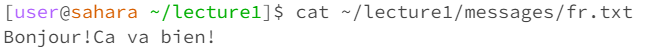

# Week-1-lab-report

## cd
### 1) no arguments.

- Working directory: ~/lecture1/
- Explanation: `cd` without any argument means chagne directory to the home directory, and it's not an error, that's why I 
### 2) with a path to a directory as an argument

- working directory: ~/
- Explanation: `cd`change directory to ./lecture1/messages, using dot at the beginning of the path because the working directory is working directory, by doing so, the working directory changeed to /home/lecture1/messages, it's not an error as well.
### 3) with a path to a file as an argument

- working directory: ~/
- Explanation: change didrectory to ~/lecture1/messages/fr.txt, it shows that the txt file fr.txt is not a directory, which means it's an error. And `cd` stands for"change directory", and .txt is not a dir.

## ls
### 1) no arguments

- working directory: ~/
- Explanation: The output are "lecture1 lecture2", it it lists all the files within the home directory. No error.
### 2) with a path to a directory as an argument

- working directory: ~/
- Explanation: output is: "Hello.class  Hello.java  messages  README" `ls` lists all the files within the lecture1 directory. No error
### 3) with a path to a file as an argument

- working directory: ~/
- Explanation: the output is "./lecture1/messages/en-us.txt" which is exactly what I've inputed for the path, when `ls` relative path to the file as a parameter, it'll output the relative path to the file. No error

## cat
### 1) no arguments

- working directory: ~/lecture1
- Explanation: It doesn't show anything, because ~/lecture1 is a directory, instead of a file, and `cat` displays the contents of the file. But no any error displayed.
### 2) with a path to a directory as an argument

- working directory: ~/lecture1
- Explanation: ~/lecture1/messages is a directory, instead of a file, and `cat` displays the contents of the file. It explains why the error message is "it's a directory"
### 3) with a path to a file as an argument

- working directory: ~/lecture1
- Explanation: `cat` displayed all contents of the file which is fr.txt, no error.
